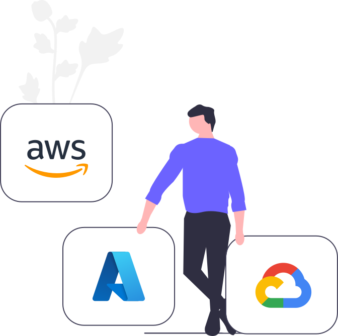
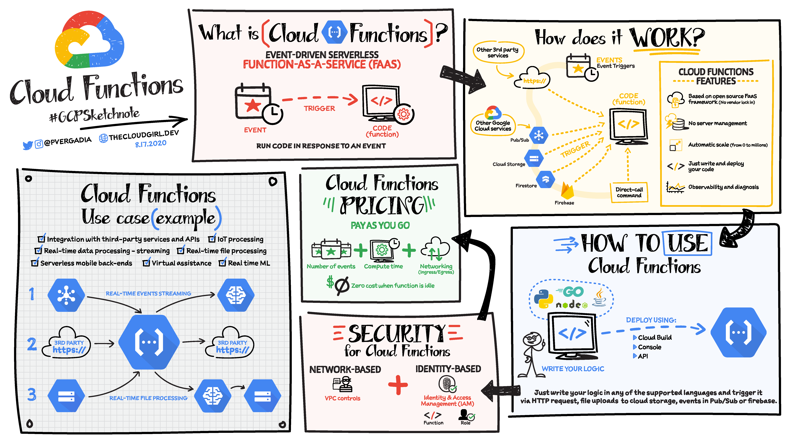
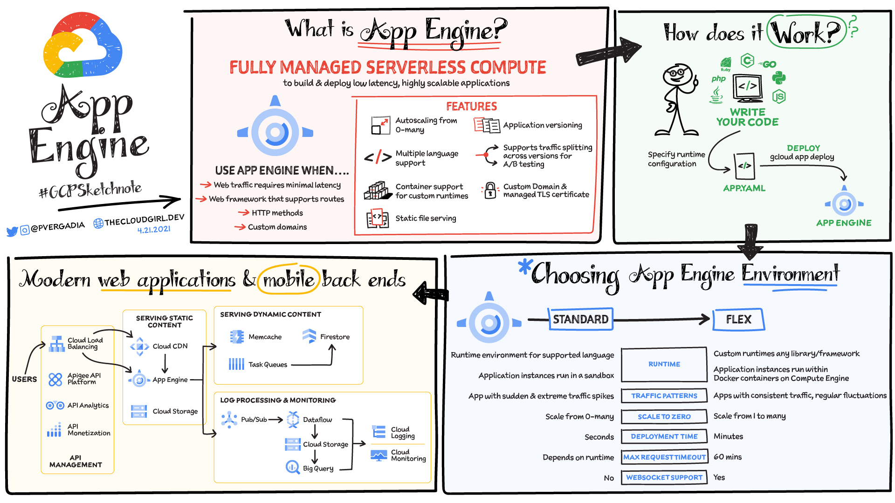
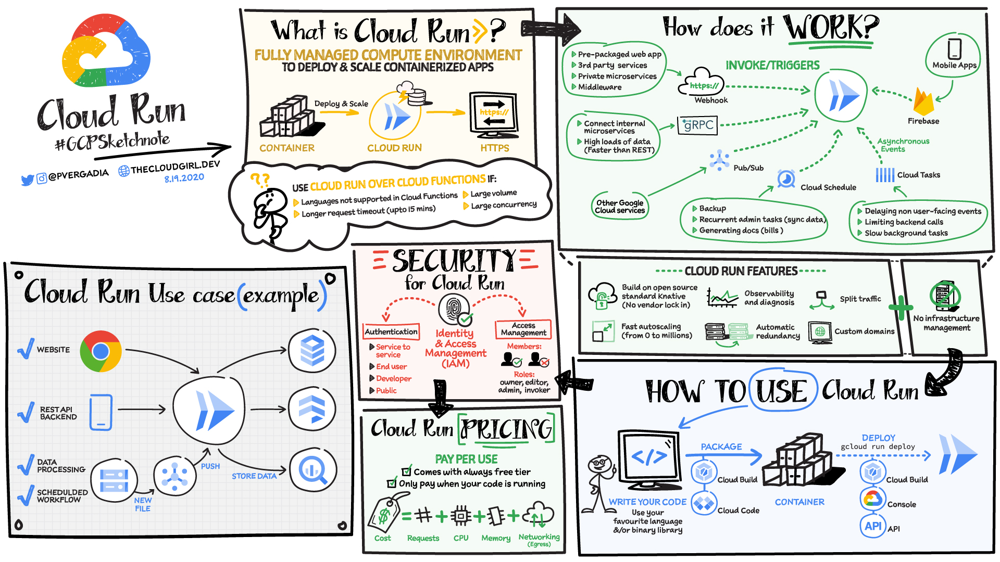
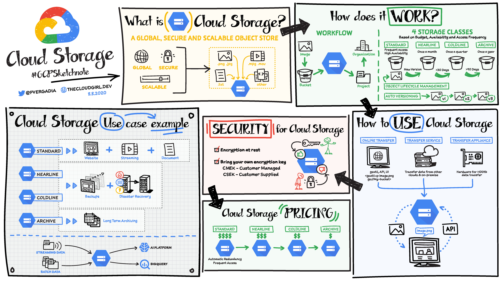

<h1 align="center">Estudos GCP</h1>

## 💻 Projeto
Esse repositório tem o objetivo de armazenar os estudos sobre Google Cloud Platform, especialmente sobre a certificação Cloud Associate Engineer.

## 🧪 Tópicos de estudos

### 00 - Fundamentos da Computação em Nuvem

**O que é Computação em Nuvem?**
- Computação em nuvem é a prática de alocar recursos computacionais através de provedores especializados, como GCP, AWS e Azure. Esses provedores oferecem a capacidade de provisionar rapidamente máquinas virtuais, proporcionando uma arquitetura que é tanto versionável quanto escalável. Esse provisionamento é facilitado por APIs de integração, permitindo que equipes de infraestrutura codifiquem e gerenciem recursos de forma eficiente.
- Além de simplificar a gestão e o provisionamento, a computação em nuvem possibilita escalabilidade. Isso significa que a capacidade de processamento pode ser ampliada sem a necessidade de aumentar a complexidade de uma única máquina. Ao invés disso, sistemas podem ser replicados em várias máquinas distintas. Para realizar esse processo, utiliza-se um balanceador de carga (load balancer), que distribui as requisições de forma equilibrada entre as diferentes máquinas. Dessa maneira, o sistema opera de maneira distribuída, garantindo eficiência e disponibilidade.

**Modelos de Serviço**

**Infraestrutura como Serviço (IaaS)** 
- Fornece acesso a recursos computacionais, como servidores virtuais, armazenamento e redes. Os usuários gerenciam os sistemas operacionais e as aplicações, enquanto o provedor de nuvem é responsável pela infraestrutura física.

**Exemplos**:
- AWS: Amazon EC2 (Simple Storage Service) para computação virtualizada, Amazon S3 (Simple Storage Service) para armazenamento de objetos, Amazon VPC (Virtual Private Cloud) para redes isoladas e Amazon RDS (Relational Database Service) para banco de dados relacionais.
- Microsoft Azure: Máquinas Virtuais para computação virtualizada, Azure Blob para armazenamento de objetos, Redes virtuais do Azure e banco de dados gerenciados, como o Azure SQL Database.
- Google Cloud Platform: Compute Engine para instâncias de máquinas virtuais, Cloud storage para armazenamento de objetos e Virtual Private Cloud (VPC) para redes privadas.

**Plataforma como Serviço (PaaS)**
- Oferece uma plataforma completa de desenvolvimento e implantação de aplicações. Os desenvolvedores podem criar, executar e gerenciar aplicações sem se preocupar com a infraestrutura subjacente.
Exemplos:
- Heroku: É uma plataforma de nuvem que permite aos desenvolvedores construir, executar e escalar padrões de forma rápida e fácil, sem se preocupar com a infraestrutura subjacente.
- Google App Engine - É uma plataforma PaaS que permite aos desenvolvedores criar e hospedar aplicações web e móveis de forma escalável gerenciada pelo Google.
- Microsoft Azure Services: Azure App Services é um serviço de PaaS da Microsoft que permite aos desenvolvedores construir, implantar e escalar aplicações WEB, móveis e API de forma rápida e eficente.

**Software como Serviço (SaaS)**
- Permite que os usuários acessem e utilizem aplicações hospededas na nuvem pela internet, geralmente atráves de um navegador WEB.

**Exemplos**:
- Salesforce - É uma plataforma de CRM (Customer Relationship Managament), baseada em nuvem que oferece uma variedade de aplicações empresariais.
- Google Workspace - É uma suite de aplicativos como Gmail, Google Drive, Google Docs, Google Sheets, Google Slides.
- Microsoft Office 365 - É uma suite de aplicações de produtividade baseada em nuvem da Microsoft que inclui Word, Excel, Powerpoint, Outlook, OneDrive, Teams e etc.

**Modelos de implantação**

**Nuvem pública** 
- Recursos são disponibilizados ao público geral e operados por provedores de servidores de nuvem.

**Nuvem privada**
- Infraestrutura de nuvem é exclusivamente por uma única organização.

**Nuvem hibrída**
- Combina nuvens públicas e privadas, permitindo a transferência de dados e aplicações entre elas.

**Vantagens**
- Escalabilidade
- Flexibilidade
- Redução de custos
- Alta disponibilidade
- Atualizações automáticas e acesso remoto

**Desvantagens**
- Questões de segurança
- Conformidade
- Dependência de provedores
- Gerenciamento de custos
---

### 1 - Fundamentos do Google Cloud Platform

**O que é?**
 - O Google Cloud Platform (GCP) é uma suíte de serviços de computação em nuvem oferecidos pelo Google.

**Tipos de serviços de computação em nuvem**

#### 1. Compute resources

**Virtual Machines**
- VM é um emulador de computador que atua como se fosse executado em um hardware físico real.
- A VM atua como um computador independente, tem seu próprio S.O, aplicações e recursos de armazenamento.
- Com a VM é possível criar sistemas de arquivos, disco rígido, atualizações do sistema operacional e etc.
- No GCP você tem total controle sobre a VM, o que colocar, quem vai acessar e quando desligar.
- É possível criar múltiplas VMs, e com o load balancer é possível ter um único ponto de acesso para um back-end distribuído.
- Se uma VM em um cluster falhar, o workload pode ser direcionado para outra VM no cluster.
- Autoscalers podem adicionar ou remover VMs do cluster baseado nos workloads (autoscaling), isso ajuda a reduzir custos e garantir que existe capacidade computacional disponível quando o workload aumentar.

**Managed Kubernetes Clusters (GKE)**
- São ambientes Kubernetes totalmente gerenciados pelo GCP.
- São responsáveis por configurar, gerenciar, atualizar e escalar o cluster.
- Isso é especialmente útil quando os usuários querem focar na sua aplicação e não na infraestrutura.
- Managed Kubernetes Clusters fazem uso de containers.
- Em Managed Kubernetes Clusters, você consegue especificar o número de servidores (VMs) e o número de containers que devem rodar nelas.
- Também é possível configurar autoscaling para o número de containers que está rodando.
- A saúde (health) dos containers é monitorada para você.
- Se um container falhar, o cluster do GKE irá detectar e iniciar outro para você.
- Os serviços são publicados (deploy) por containers, e o serviço gerenciador de clusters cuida do monitoramento, rede e gerenciamento de tasks de segurança.

**Serveless Computing**
- Serveless Computing é um modelo de execução de aplicações na nuvem em que o provedor de serviços gerencia automaticamente a infraestrutura necessária para executar o código.
- Tanto VMs quanto o GKE necessitam de algum esforço de configuração e administração de recursos computacionais, enquanto no Serveless Computing, isso não é necessário.
- No Serveless Computing a precificação é baseada no consumo real de recursos, como o tempo de execução do código e a quantidade de memória utilizada. Isso significa que os usuários só pagam pelo tempo que o código está em execução.
- AutoScale automático de acordo com à demanda, ou seja, consegue alocar mais ou menos recursos de acordo com que a aplicação precisa.
- Pode ser projetada para executar código em resposta a eventos específicos, como alterações em banco de dados, upload de arquivos ou chamadas de API. Isso é conhecido como funções serveless (FaaS).
- Reduz o overhead para os desenvolvedores, permitindo que eles foquem na lógica da aplicação pela redução do tempo em operar e manter a infraestrutura.

**Três tipos de serveless computing**

**Cloud Functions**
- É um serviço para rodar código em resposta a um evento (trigger), como upload de um arquivo, adição de uma mensagem na fila, alterações em banco de dados ou chamadas na API e etc.
- É uma boa opção quando é necessário responder um evento (trigger) rodando uma porção de código em uma função ou para chamar uma aplicação que pode estar contida na VM, GKE ou App Engine.
- Escala automaticamente de acordo com a demanda, executando o código em resposta a eventos específicos.
- Suporta várias linguagens programação como: C#, Java, Go, Python e etc.

**App Engine**
- É uma plataforma de desenvolvimento e hospedagem de aplicações totalmente gerenciada que permite que os desenvolvedores não se preocupem com infraestrutura.
- Usado para aplicações que ficam ativas em longos períodos de tempo, como o back-end de um site, pontos de venda e etc.
- Fornece ambiente de desenvolvimento e hospedagem de aplicações diretamente, com bases nas linguagens suportadas por ele.
- Fornece escalabilidade automática com base na demanda da aplicação.
- Pode ser configurado para executar aplicações em ambientes padrão ou flexível.

**Cloud Run**
- É um serviço que permite execução de containers de maneira serveless, fornecendo uma camada de abstração sobre a infraestrutura.
- Criação de containers usando qualquer linguagem de programação e execução como serviços serveless.
- Fornece escalabilidade automática com base na demanda.
- É usado quando todas as funcionalidades do Kubernetes não são necessárias.

 #### 2. Storage
- Provedores de nuvem oferecem alguns tipos de serviço de armazenamento que são úteis para diversos requisitos da aplicações

 **Object Storage ou Cloud Storage**
 - O object storage é um sistema que gerencia o armazenamento de objetos em objects ou blobs, de forma segura, escalável e global.
 - É usado para objetos que tem dados imutáveis, como imagens, textos, videos e outros formatos de arquivos.
 - Normalmente esses objetos são arquivos, mas não armazenados num sistema de arquivos convencional.
 - Objects são agrupados em buckets, ou seja são containers de armazenamento para objects.
 - Buckets tem um nome globalmente exclusivo, o que significa que os buckets devem ser únicos em todo o GCP.
 - Dentro do bucket, você pode organizar seus objetos em uma estrutura de diretórios ou pastas (apesar de não existirem diretórios reais).
 - É possível configurar políticas de controle de acesso para buckets, especificando quem pode acessar e executar ações nos objects. Isso é feito pelo Identity and Access Management (IAM) do GCP.
 - Você pode também escolher a localização geográfica em que o bucket será armazenado. Isso afeta latência e desempenho.
 - Cada object é individualmente acessível por meio de uma URL.
 - Object storage não são limitados pelo tamanho do disco ou por SSDs anexados ao servidor.
 - Múltiplas cópias de objects são armazenados para melhorar disponibilidade e durabilidade.
 - Em alguns casos, objects são salvos em diferentes regiões para garantir disponibilidade, quando uma região não estiver disponível.
 - É serveless, não é necessário uma VM para anexar storage para ele.

 

 **File Storage ou Cloud Filestore**
- File storage é um serviço de armazenamento gerenciado pelo GCP para oferecer compartilhamento de arquivos totalmente gerenciado para VMs.
- O objetivo é fornecer um sistema de arquivos compartilhado e acessível para várias VMs em uma mesma rede.
- Baseado no protocolo de sistema de arquivos de rede (NFS), facilitando integrações com sistemas operacionais Linux.
- Oferece tipos de armazenamento Standard e SSD.
- Integra com outros serviços e recursos do GCP, como Identity and Access Management (IAM), VPC (Virtual Private Cloud) e outras ferramentas.
- Suporta políticas de controle de acesso baseados em IAM, garantindo que apenas VMs autorizadas possam acessar o compartilhamento de arquivos.
- Alguns exemplos de uso são: armazenamento de dados para Aplicações Linux, desenvolvimento e teste colaborativo, processamento de dados em lote, armazenamento compartilhado de informações e renderização de animações gráficas.
 
 **Block Storage**
 **Caches**

#### 3. Networking

#### 4. Serviços especializados, como Machine Learning

---
### 2 - Google Cloud Computing Services

### 3 - Projetos, Service Accounts e Billings

**Projetos**
- Cada recurso do GCP está organizado em projetos (billings, storages, network e etc).
- Cada projeto tem um nome e um ID.

### 4 - Introdução a Computação em Google Cloud

### 5 - Computing com Compute Engine Virtual Machine 

 **Regiões**
 - O GCP consiste de recursos físicos e recursos virtuais.
 - Os recursos físicos ou virtuais estão disponíveis nos data centers do Google.
 - Os data centers estão distribuídos em **regiões**.
 - Os data centers estão localizados na Ásia, Europa, Austrália, Américas, Oceania e entre outros e em cada uma dessas regiões tem divisões que são chamadas **zonas**.
 - Cada zona tem um nome e é independente de outra zona para permitir redundância. Ex: **us-west1** é uma **região** da costa oeste dos Estados Unidos que tem três **zonas**: **us-west1-a**, **us-west1-b** e **us-west1-c**.
 - Alguns recursos somente podem ser visto pela zona em que ele reside, como por exemplo, instâncias de máquinas virtuais (virtual machine instances) e disco rígido zonais (zonal disk persistent), ou seja, só podem ser usados por recursos dessa mesma zona.
 - Alguns recursos são regionais, como por exemplo, um endereço de IP externo (external IP Address), pode ser usado por qualquer outro recurso naquela região independente da zona.
 - Ex: Se você quiser anexar um disco rígido (disk persistent) a uma máquina virtual (instance), ambos devem estar na mesma zona. Assim como, se você quiser endereçar um endereço de IP estático externo (external static IP Address) para uma instância (virtual machine), a instância deve estar na mesma região do endereço de IP (external IP Address).

**Notas**
-IP estático externo:
- Refere-se a um endereço IP (IPV4) que não muda, independentemente de reinicilizações ou desconexões.
- Fixo e permanente para o recurso ou dispositivo ao qual foi atribuído.
- Usado para situações que é necessário comunicação com a Internet ou recursos que estão em outra VPC Network, se as políticas de Firewall ou políticas permitirem a conexão, origens de fora de uma VPC conseguem acessar esse recurso.
- Somente recursos com um IP externo podem se comunicar com recursos fora da VPC Network.
- Endereços de IPv4 externos estão disponíveis para todas as VMs.
- São úteis para serviços ou aplicações que precisam ser acessíveis constantemente por um endereço IP específico, um endereço IP estático é essencial. Isso é comum em configurações de rede que exigem regras de firewall específicas, VPNs, ou quando se deseja evitar interrupções na comunicação devido a mudanças no endereço IP.
- A comunicação de um recurso usando um IP externo estático pode resultar em custos.
- Um endereço IP estático pode melhorar a segurança, pois permite a configuração de regras de firewall ou políticas de redes específicas para um IP conhecido e fixo. Além disso, para aplicações críticas ou serviços que requerem alta disponibilidade, a previsibilidade pode contribuir para uma operação mais confiável.

### 6 - Gerenciando Virtual Machines

### 7 - Computação com Kubernetes

### 8 - Gerenciando Cluster Kubernetes

### 9 - Computação com Cloud Run e App Engine

### 10 - Computação com Cloud Functions

### 11 - Planejando Storage na Cloud

### 12 - Deploying Storage no Google Cloud

### 13 - Carregando datas no Storage

### 14 - Network na Cloud: Virtual Private Clouds e Virtual Private Networks

### 15 - Network na Cloud: DNS, Load Balancing, Google Private Access e IP Addressing

### 16 - Deploying Applications com Cloud Marketplace e Cloud Foundation Toolkit

### 17 - Configurando acesso e segurança

### 18 - Monitorando, Logando e Estimando Custos

### 19 - Simulados

## 🚀 Materiais
- [Documentação do Google Cloud](https://cloud.google.com/docs?hl=pt-br)
- [Awesome GCP Certifications](https://github.com/sathishvj/awesome-gcp-certifications)
- [Alura](https://cursos.alura.com.br/course/google-cloud-engineer-certificacao-parte1)
- [Coursera](https://www.coursera.org/professional-certificates/cloud-engineering-gcp)
- [FreedCodeCamp](https://www.youtube.com/watch?v=jpno8FSqpc8&t=1435se)
- [Mapas mentais](https://thecloudgirl.dev/)
- [Vídeos GCP do Google](https://www.youtube.com/user/googlecloudplatform)
- [Livro oficial do Google](https://www.google.com.br/books/edition/Google_Cloud_Certified_Associate_Cloud_E/YcirEAAAQBAJ?hl=pt-BR&gbpv=1&dq=Official+Google+Cloud+Certified+Associate+Cloud+Engineer&printsec=frontcover)
- [ExamsTopics](https://www.examtopics.com/exams/google/associate-cloud-engineer/?source=post_page-----4af23a742b49--------------------------------)
- [Udemy](https://www.udemy.com/course/google-cloud-certification-associate-cloud-engineer/)